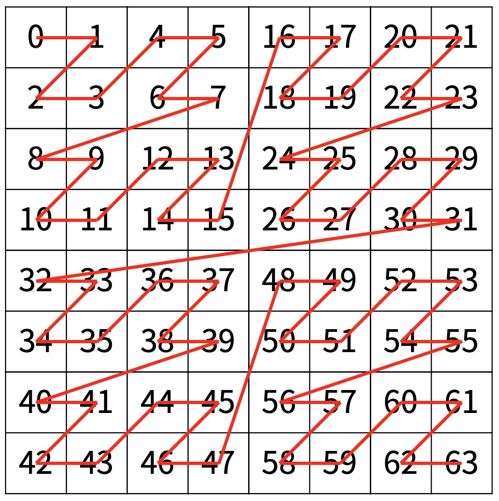

# 재귀함수

함수 안에서 자기 자신을 다시 호출하는 함수를 재귀함수라고 한다.

알고리즘에서는 탑다운DP, 백트래킹, DFS, 분할정복 등등 여러 방식으로 재귀함수를 사용한다.

하지만 재귀라는 굉장히 와닿지 않고, 직관적으로 받아들여지지 않는다. 

개인적으로 재귀를 이해하는데 가장 도움이 됐엇던 말은, 백준 단계별로 풀어보기에서 있었던 것 같은데 (지금은 없는듯..?)

```
너무 깊게 생각하지 마세요.

나머지는 컴퓨터가 알아서 해줄거에요.
```

이 말이었던것 같다. 재귀함수의 흐름을 하나하나 시뮬레이션 하는것도 처음에는 물론 필요하다.

다만 문제를 풀어보면서 가장 크게 느끼는 점은 두가지이다.

- **특정 재귀함수의 호출이 어떠한 일을 하는지 명확하게 정의해야 한다.**

- **'이미 계산되어 있을 것이다!'** 라는 마인드가 필요하다.

## 예시 1. 팩토리얼

```java
public static int f(int n) {
    if (n == 1) return 1;
    return n * f(n-1);
}
```

위의 코드를 예시로 생각해보자. f(n)이 하는 일은 무엇일까? f(n)은 어떻게 정의되는걸까?

**혹은 내가 팩토리얼을 재귀로 구현하는 상황이었다면, f(n)을 어떻게 정의했어야 했을까?**

좀 더 구체적으로 생각해보면?

f(5)는 5 * 4 * 3 * 2 * 1 , 즉 5부터 1까지의 곱이다. 5!

일반화 하면 f(n)은 n*(n-1) * (n-2) ... * 1이다.

점화식으로 적어보면? f(n) = n * f(n-1) 이다.

그렇기 때문에? `return n * f(n-1);` 이라고 적는다.

여기서 f(n-1)을 호출한다는 것에 대해서 당황하지말고, 너무 깊게 생각할필요도 없다. 

우리는 이미 f(n)이 1부터 n까지의 곱이라는것을 **명확하게 정의** 했다. 

그리고 f(n)이 f(n) = n * f(n-1)의 점화식 형태를 가진다는 것도 알 수 있다. 그러면 그냥 그것을 함수에 옮기면 된다.

f(n-1)에 대한 값은 컴퓨터가 알아서 구해줄것이다!

다만 한없이 f(n-1)을 호출할 수는 없으니 종료조건이라는 것을 적어줘야 한다.

그게 `if(n==1) return 1` 이 부분이고, 사실 종료조건을 설정하는 것은 몇번 해보면 되서, 어렵지 않은일이다.

## 예시 2. [BOJ1074 : Z](https://www.acmicpc.net/problem/1074)

이 문제에서 f(?) 는 어떻게 정의해야 할까?

우선 파라미터에 무엇이 들어가야 할지 생각해보아야 한다.

파라미터는 상태를 의미하고, 결국 모든 함수의 본질은 '상태들이 이렇게 주어졌을 때, 무엇을 반환하느냐' 이다.

문제를 읽었을 때 직관적으로 알 수 있는것은,

정사각형 4개로 구간을 나누고 정사각형을 줄여가면서, 재귀적으로 들어가야겠다는 생각이 든다.

따라서 우리가 초점을 맞춰야하는 것은 **'정사각형의 상태'** 이고,

정사각형의 상태를 계속 변화시키면서 어떠한 처리를 해주어야 겠다는 생각을 할 수 있다.

그렇다면 정사각형의 상태를 어떻게 잡아야할까?

1. 왼쪽 위의 점의 좌표와, 오른쪽 아래의 점이 주어지면 정사각형을 특정할 수 있다.

2. 왼쪽 위의 점의 좌표와, 정사각형 변의 길이가 주어지면 정사각형을 특정지을 수 있다.

둘 다 좋지만, 이 문제는 구현의 편의상 2번의 방식으로 풀이한다.

메서드 시그니쳐는 `f(int r, int c, int len)` 이런식으로 가져가면 괜찮을 것 같다.

r과 c는 왼쪽위 점의 좌표이고, len은 정사각형 변의 길이이다.

그리고 추가로 타겟좌표의 정보가 필요하다. (앞으로 tr : targetR, tc : targetC 로 축약)

타겟좌표의 정보도 파라미터로 가져가도 문제는 없지만 고정값이므로 편의상 전역변수 (static)로 가져간다.

<br>

상태(파라미터)를 올바르게 정의했다. 이제 **다음 단계는 함수의 의미를 정의**해야 한다.

우리가 구하고자 하는것은 정사각형이 주어졌을 때, Target이 몇 번째로 방문되는지(편의상 거리라고 통칭)이다. 

이 정의에 부합하도록 함수의 정의를 가져가면 된다. 

`f(int r, int c, int len)`의 정의는 **사각형의 정보가 주어졌을 때, 해당 사각형에서 Target까지의 거리**이다.

따라서 반환형을 int로 잡고 시그니처를 `int f(int r, int c, int len)` 으로 가져가면 된다.

<br>

함수의 의미를 정의했으니, 이제 부분구조에 의해 점화식이 어떻게 도출되는지 고민해야 한다.

Target이 (6,2) (=> 아래의 44 자리) 라고 생각해보자.

각 사분면은 왼쪽위 -> 오른쪽위 -> 왼아래 -> 오른아래 순으로 1, 2, 3, 4 사분면이라고 정의한다.




target(6, 2) 일 때, f(0, 0, 8) 는 

3사분면 사각형까지의 거리(32) + 3사분면에 해당하는 사각형부터 target 까지의 거리이다.

즉, 32 + f(5, 0, 4) 가 된다.

점화식으로 정의하면 f(r, c, len)과 target이 주어졌을 때,

```
f(r, c, len) = target을 포함하는 사각형까지의 거리 + 해당 사각형에서 target까지의 거리이다.
```

하나씩 뜯어보자. 

target을 포함하는 사각형까지의 거리는 큰 사각형의 변의 길이를 반으로 줄여 쉽게 구할 수 있다.

그리고 해당사각형에서 target까지의 거리에 대해 정의한 것이 `int f(int r, int c, int len)` 였다.

위의 내용을 코드로 옮기면 아래와 같다.

```java
import java.io.*;
import java.util.*;
class Main {
    static BufferedReader br = new BufferedReader(new InputStreamReader(System.in));
    static StringTokenizer st;
    static int targetR, targetC;
    public static void main(String[] args) throws IOException {
        st = new StringTokenizer(br.readLine());
        int N = Integer.parseInt(st.nextToken());
        targetR = Integer.parseInt(st.nextToken());
        targetC = Integer.parseInt(st.nextToken());

        int size = (int) Math.pow(2, N);
        System.out.println(f(0, 0, size));
    }


    static int f(int r, int c, int size) {
        if (size == 1) {
            return 0;
        }
        size /= 2;
        
        //target이 1사분면에 있는가?
        if (targetR < r+ size && targetC < c + size) {
            //1사분면 사각형까지의 거리 (0) + 해당 사각형에서 target까지의 거리
            return f(r, c, size); 
        } 
        //target이 2사분면에 있는가?
        else if (targetR < r+size && targetC < c + size* 2) {
            //2사분면 사각형까지의 거리 + 해당 사각형에서 target까지의 거리
            return size * size + f(r, c+size, size); 
        } 
        //target이 3사분면에 있는가?
        else if (targetR < r+size * 2 && targetC < c + size) {
            //3사분면 사각형까지의 거리 + 해당 사각형에서 target까지의 거리
            return 2 * size* size + f(r+size, c, size);
        } 
        //target이 4사분면에 있는가?
        else {
            //4사분면 사각형까지의 거리 + 해당 사각형에서 target까지의 거리
            return 3 * size * size + f(r+size, c+size, size);
        }
    }
}
```

거듭 말하지만, 재귀 호출에 대해서 깊게 생각하지말자. 재귀 설계를 올바르게 했으면 알아서 해줄거라는 믿음이 있어야 한다.

## 반환형이 없는 재귀

